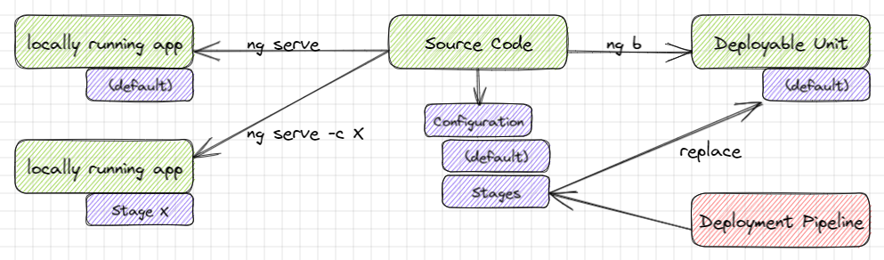

# 📚 Tutorial: Angular - Build Once, Run Anywhere

[](https://github.com/ueberfuhr-tutorials/ng-buildonce-deployanywhere/actions/workflows/node.js.yml)

## The Challenge

Like backends, also frontends are installed into several stages, and each stage needs its own configuration. The most common setting is the URL to the backend, but there can also be settings for authentication, theming and so on...

### The Angular Way _(and what's the problem with that)_

When creating an Angular project, there is already a solution for this: [Environments](https://angular.io/guide/build). The essence of this approach is the following:

- Create an `environment.<stage>.ts` file for each stage and define the same constant in it (with differing values).
- `environment.ts` is the file that is used as default. It is imported by the application's sources whenever the constant is needed.
- Create a configuration for each stage in the `angular.json` file. Replace `environment.ts` by `environment.<stage>.ts` during build. (The content of the file is then compiled and compressed within the `main.js` file and therefore not replaceable afterneath.)
- Run the build with `ng b -c <stage>`. (Since Angular 12, `production` is the default build mode.)

But the downside of this solution is setting the stage while building. This means that each stage has to be built separately. Ultimately, this is only partially practical, especially in the context of a CI/CD pipeline.

### The Requirements for a Suitable Solution

_Build Once, Run Anywhere_ is the name of the principle that would match our needs. So the solution should allow to deploy the application in several stages without rebuilding it. At most, replacing or adapting individual configuration files would be
acceptable.

But there are further requirements to a possible solution:

- The configuration must be **available at the client`s browser**. _(Setting environment variables at the server-side is not a possible way unless these variables are not provided for the client.)_
- **Only** the configuration for **the current stage** should be available at the client's browser. _(So providing all stage's configurations at the client and using a switch specific to the stage could get safety relevant.)_
- It is **independent of any deployment infrastructure** (like nginx), it should only use Angular/NPM/TS/JS resources.
- It should deal correctly with the browser cache. _(Changes to the configuration should affect the application immediately.)_
- It should also **work within the development environment** (`ng serve`). We should be able to switch the stage for testing purposes locally.



## The Solution

So the intuitive approach is to offload the environment configurations from the build and provide them at runtime instead. This can probably only be implemented in such a way that the configuration is loaded from the client as a separate artifact when
bootstrapping the front end. The question that then arises is the specific implementation using NPM, Angular, Typescript or ES.

### Current Solution in This Repository

The solution in this repository is the following:

#### 1. Declare Environments

We replace the `environment.ts` files by JSON configurations.

```json
{
  "stage": "local",
  "apiEndpoint": "http://localhost:8080/api/v1"
}
```

We can place them into the [➡ `environments` folder](src/environments) to keep the usual structure.

#### 2. Customize Angular Configuration

We must then add the JSON configuration into [➡`angular.json`](angular.json) as an `assets` entry. To allow running stage-specific configurations locally, we can declare configurations as usual with an additional `assets` entry too. _(Because this does not
allow renaming files, we need to name all JSON files the same and place the stage-specific files into subdirectories.)_
In case of existing configurations, we must also remove the `fileReplacements` entry for `environment.ts`.

```json
{
  "projects": {
    "ng-buildonce-deployanywhere": {
      "architect": {
        "build": {
          "options": {
            "assets": [
              "src/favicon.ico",
              "src/assets",
              {
                "glob": "app-config.json",
                "input": "src/environments",
                "output": "."
              }
            ]
          },
          "configurations": {
            "production": {
              "assets": [
                "src/favicon.ico",
                "src/assets",
                {
                  "glob": "app-config.json",
                  "input": "src/environments/prod",
                  "output": "."
                }
              ]
            }
          }
        }
      }
    },
    "defaultProject": "ng-buildonce-deployanywhere"
  }
}
```

**Please note** that working with configurations still allows stage-specific builds. The difference is that we alternatively can replace the stage-specific part by a simple file replacement.

#### 3. Load the Configuration

##### 3.1. On Application Bootstrap

In [➡`main.ts`](src/main.ts), we must load the JSON configuration by a separate HTTP call. In our example, we use the [Fetch API](https://developer.mozilla.org/en-US/docs/Web/API/Fetch_API).

So the initial code

```typescript
if (environment.production) {
  enableProdMode();
}

platformBrowserDynamic().bootstrapModule(AppModule)
  .catch(err => console.error(err));
```

will change to

```typescript
fetch('app-config.json', {cache: 'reload'}) // no caching!
  .then(response => response.json())
  .catch(error => { // me must ensure that in case of error, the app starts anyway
    // log error to console
    console.error(error);
    // use default values in case of error
    return {
      stage: 'prod',
      apiEndpoint: './api/v1'
    };
  })
  .then(config => {
    if (config.stage === 'prod') {
      enableProdMode();
    }
    return platformBrowserDynamic().bootstrapModule(AppModule);
  })
  .catch(err => console.error(err));
```

But so should be aware that, if loading fails, the whole application won't start.

##### 3.2. Code Improvements

Optionally, to make the configuration type safe and injectable, we declare an [➡interface and injection token(s)](src/environments/app-config.model.ts) and use them in `main.ts`.

```typescript
export interface AppConfig {
  stage: 'local' | 'dev' | 'prod';
  apiEndpoint: string;
}

export const APP_CONFIG = new InjectionToken<AppConfig>('app.config');
```

```typescript
fetch('app-config.json', {cache: 'reload'}) // no caching!
  .then(response => response.json() as unknown as AppConfig)
  .catch(error => {
    // ...
    return {
        // ...
    } as AppConfig;
  })
  .then(config => {
    // ...
    return platformBrowserDynamic([
      {provide: APP_CONFIG, useValue: config}
    ]).bootstrapModule(AppModule);
  })
```

##### 3.3. Use AppInitializer and Service

We can put the loading magic into an Angular Service and use the `HttpClient`:

```typescript
@Injectable({
  providedIn: 'root'
})
export class ConfigService {

  private env: AppConfig = {
    apiEndpoint: 'http://localhost',
    stage: 'local'
  };

  constructor(private http: HttpClient) {
  }

  get config(): AppConfig {
    return this.env;
  }

  loadConfig(): Observable<AppConfig> {
    return this.http.get<AppConfig>('app-config.json')
      .pipe(
        tap(env => this.env = env)
      );
  }

}
```

Then, we define a module that uses the service as an application initializer
and provides the configuration for Dependency Injection:

```typescript
function loadConfig(config: ConfigService): () => Observable<AppConfig> {
  return () => config.loadConfig().pipe(
    // we could enable the prod mode here
    tap(config => {
        if(config.stage === 'prod') {
            enabledProdMode();
        }
    })
  );
}

@NgModule({
  imports: [
    HttpClientModule
  ],
  providers: [
    {
      provide: APP_INITIALIZER,
      useFactory: loadConfig,
      deps: [ConfigService],
      multi: true
    },
    {
      provide: APP_CONFIG,
      useFactory: (configService: ConfigService) => configService.config,
      deps: [ConfigService],
    }
  ]
})
export class ConfigModule {
}
```

We only need to import this module into the `AppModule`.

#### 4. Use the Configration

We can then inject the configuration in our Angular components, services, ...

```typescript
export class AppComponent {

  constructor(@Inject(APP_CONFIG) public readonly config: AppConfig) {
      // config.apiEndpoint
  }

}
```

### Possible deviations

The solution described is a sample, from which we can deviate in individual things.

#### Generation of JSON Configuration

The JSON that holds the environment-specific configuration doesn't necessarily have to be placed within the source code.
If we do not need to run such configuration locally, it could also be possible to
 - create the JSON during deployment (e.g. create and copy the file into the target container)
 - configure environment variables in the target container and let the HTTP server provide them as JSON ([as described here in case of nginx](https://developers.redhat.com/blog/2021/03/04/making-environment-variables-accessible-in-front-end-containers#inject_the_environment_variables))

#### Usage of ES instead of JSON

Instead of JSON, we could also provide a script
_(declaring the configuration as a constant or providing a method constructing the configuration)_
that we also need to download on application bootstrap.
This would be more flexible, but we'd have to run the script after download using `eval(...)`.
